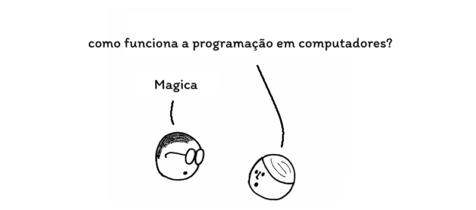

# Aprenda Javascript

Este livro ensinará o básico de programação e Javascript. Quer você seja um programador experiente ou não, este livro é destinado a todos que desejam aprender a linguagem de programação JavaScript.

JavaScript (abreviado _JS_) é a linguagem de programação que permite que as páginas da web respondam à interação do usuário além do nível básico. Foi criada em 1995 e é hoje uma das linguagens de programação mais famosas e utilizadas.